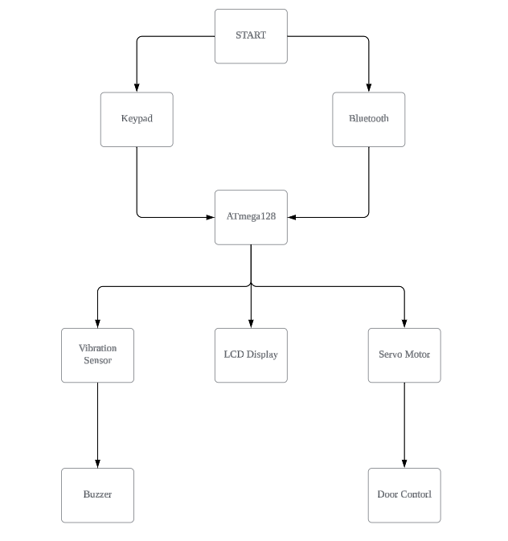

# 🔐 ATmega128A Firmware – Smart Locker System

## 🔎 Overview
This firmware is designed for the **ATmega128A Security System Board**.
It integrates keypad password entry, LCD feedback, Bluetooth control, servo motor door actuation, vibration detection, and buzzer alarms.
The system supports **PIN verification, password change, vibration-based tamper alerts, lockout after repeated failures, and remote Bluetooth door control**.

---

## 📊 System Block Diagram

---

## ⚙️ Features

- **Password Authentication**
  - 4-digit PIN entry via **Keypad (J5)**
  - Password change supported (`*` → old password → new password)
  - LCD shows password entry & system status

- **Door Control**
  - **Servo motor** opens on correct password or Bluetooth `1` command
  - Auto-closes after 10 seconds or `#` press
  - Bluetooth `0` command forces door close

- **Tamper Detection**
  - **SW-420 vibration sensor** monitors physical shock
  - >5 consecutive hits triggers buzzer alarm + LCD warning
  - Resets to password input screen afterward

- **Buzzer Alerts**
  - Success melody (correct PIN / open door)
  - Warning tone (wrong PIN / vibration detected)

- **Security Lockout**
  - After **5 failed attempts**, system locks for **30 seconds**
  - LCD shows countdown timer

- **Bluetooth Remote Control**
  - `1` = Open door
  - `0` = Close door

---

## 🧩 Key Functions in Code

- `InitDevices()` → Peripheral initialization (PWM, UART, GPIO)
- `SetServoAngle(angle)` → Servo motor positioning (−90° closed, +90° open)
- `PlayTone(f, d)` → Generate tone on buzzer (frequency, duration)
- `PlaySuccessTune()` → Melody on successful unlock
- `CheckVibrationSensor()` → Detect repeated vibration & raise alarm
- `KeyScan()` → 4x3 keypad scanning with debounce + beep feedback
- `BluetoothReceive()` → UART0 data polling (HC-06)
- `DisplayMessage(line1, line2)` → LCD line output utility

---

## 📜 Example Workflow
1. **Startup**
   - LCD: `Welcome! Daejin Locker`
   - Prompt: `Insert Password`

2. **Password Handling**
   - User enters 4-digit PIN + `#`
   - If correct → door opens, melody plays
   - If wrong → error tone, retry prompt

3. **Failure Handling**
   - After 5 wrong attempts → 30s lockout
   - LCD shows countdown: `Wait: XX sec`

4. **Tamper Handling**
   - Vibration detected ≥5 times → alarm tone
   - LCD: `Don't hit it!!` → resets to password prompt

5. **Bluetooth**
   - Receive `1` → Door opens
   - Receive `0` → Door closes

---

## 📱 Mobile App (MIT App Inventor)

A companion **Android App** was created using **MIT App Inventor**  
to control the ATmega128A Smart Locker via Bluetooth.

| Main Screen | Sign Up Screen | Control Screen |
|-------------|--------------|----------------|
| .png) | .png) | .png) |

- **Main Screen**
  - Bluetooth pairing, Open/Close control
  - Door status feedback  

- **Login Screen**
  - User authentication (ID + Password)

- **Sign Up Screen**
  - Register new users (ID, Password, Name)
