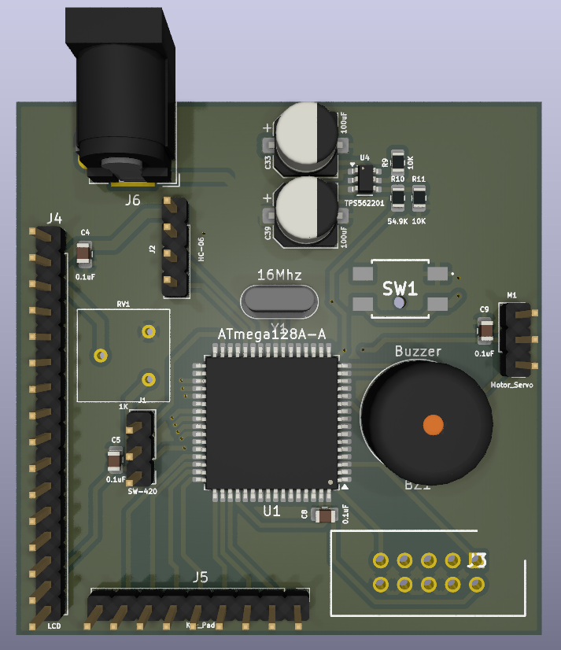
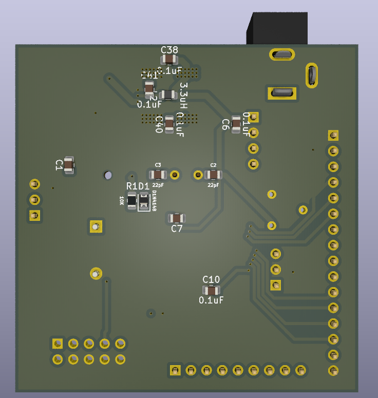
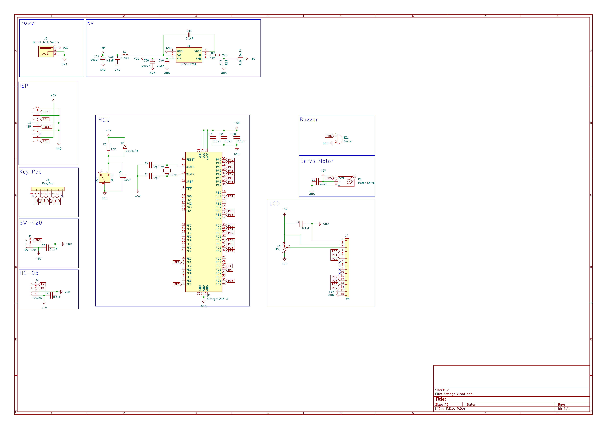

# ATmega128A Development Board

## 🔎 Overview
The **ATmega128A Development Board** is a versatile embedded platform for **AVR microcontroller learning, prototyping, and embedded system design**.  
It integrates stable power delivery, multiple communication interfaces, keypad & LCD modules, and expansion connectors for external devices.

---

## 📸 PCB Overview
| Top View | Bottom View |
|----------|-------------|
|  |  |

---

## 📑 Design Resources
- **Schematics**: [Atmega.pdf](Atmega.pdf) (KiCad 9.0.4)

---

## 🔧 Key Hardware Notes
- **EDA Tool**: KiCad 9.0.4  
- **PCB Stackup**: 2-layer standard  
- **MCU**: ATmega128A-AU (8-bit AVR, Ports A–G exposed)  
- **Power**: 12 V input → 5 V & 3.3 V rails (TPS562201 regulators)  
- **Interfaces**: USB-to-Serial (FT232RL), ISP programmer header  
- **User IO**: Keypad, LCD, Servo motor, Buzzer, LEDs  
- **Sensors**: SW-420 vibration/shock sensor  
- **Communication**: HC-06 Bluetooth module

---

## 🧩 Schematic Highlights

### 1) MCU — ATmega128A-AU  
- **Role**: Central controller for all peripherals  
- **Features**: GPIO Ports A–G, external 16 MHz crystal, reset circuit  
- **Purpose**: Main processing unit for password and control logic

---

### 2) Power
- **Input**: Barrel Jack (12 V)  
- **Regulators**: TPS562201-5.0 & TPS562201-3.3  
- **Purpose**: Stable dual-voltage supply for mixed 5 V / 3.3 V peripherals

---

### 3) Communication 
- **USB-to-Serial**: FT232RL for PC connection & firmware upload  
- **ISP**: 6-pin header for direct programming  
- **Bluetooth (J2)**: HC-06 for wireless communication

---

### 4) User I/O
- **Keypad (J5)**: Password input & modification  
- **LCD (J4)**: Password confirmation, error display, lockout countdown  
- **LEDs (D1–D4)**: Status indicators  
- **Buzzer**: Alarm on wrong password or vibration detection  
- **Servo Motor**: Unlocks on correct password; locked otherwise  
- **SW-420 Sensor (J1)**: Detects vibration/shock for tamper alert

---

## ✅ Progress
- [x] Schematics completed  
- [x] PCB fabricated  
- [x] Power supply tested (5 V / 3.3 V OK)  
- [x] USB-Serial & ISP programming validated  
- [x] Keypad & LCD integrated  
- [x] Bluetooth bring-up (HC-06)  
- [x] Security application firmware in progress  

---

## 📂 Folder Layout
