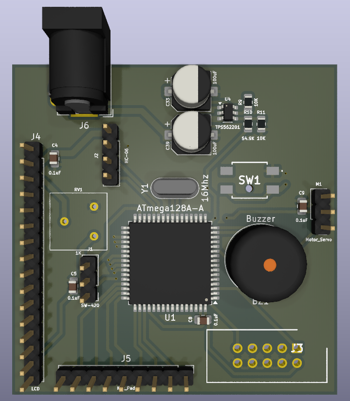
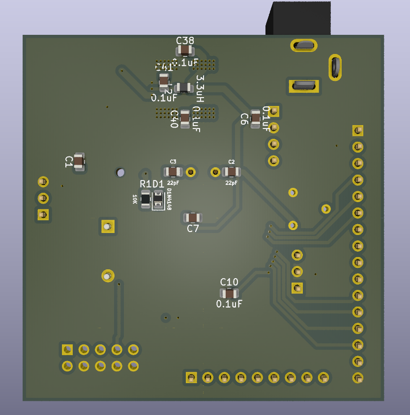
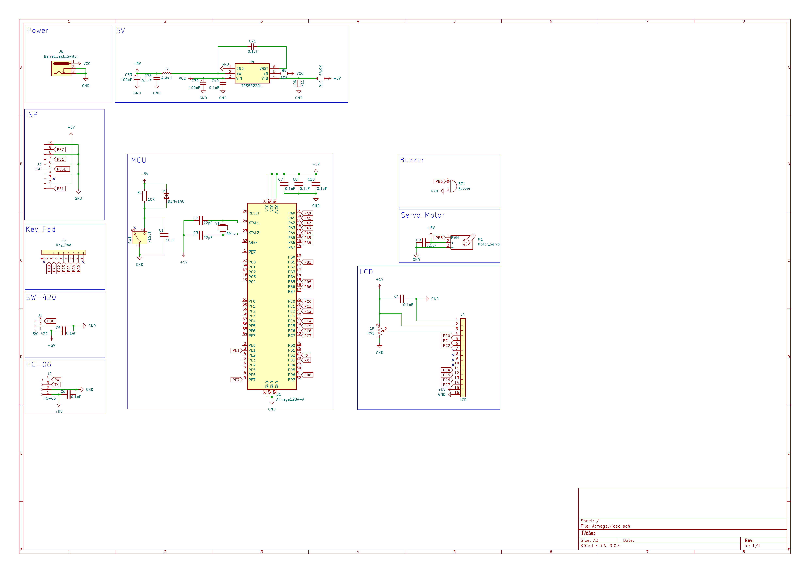

# ATmega128A Security System Board

> Keypad + LCD + Bluetooth(HC‑06) + Shock Sensor(SW‑420) + Servo Lock + Buzzer
> Education & Smart Access Control Prototyping Platform

---

## 🔎 Overview
The **ATmega128A Security System Board** is a compact AVR platform for **learning, prototyping, and access‑control demos**.
It integrates **12 V → 5 V/3.3 V** power, **USB‑UART**, **ISP programming**, **keypad+LCD UI**, **HC‑06 Bluetooth**, **SW‑420 vibration detection**, **servo lock**, and **buzzer alerts**.

---

## 📸 PCB Overview
| Top View | Bottom View |
|----------|-------------|
|  |  |

> Schematics (PNG): 

---

## 📑 Design Resources
- **MCU**: ATmega128A‑AU (8‑bit AVR)
- **EDA**: KiCad 9.0.x
- **Board**: 2‑layer

---

## ⚙️ Key Hardware Notes
- **Power**: 12 V barrel jack → **TPS562201‑5.0 / TPS562201‑3.3** rails
- **Clock**: 16 MHz crystal
- **Programming**: **ISP header** (AVRDUDE/USBasp/Atmel‑ICE)
- **USB‑UART**: FT232RL (debug console / host comms)
- **UI/Peripherals**:
  - **Keypad (J5)**: enter/change password
  - **LCD (J4)**: show result/tries/lockout timer
  - **Servo**: unlock on success; stay locked on failure
  - **Buzzer**: success/fail tone + vibration alarm
  - **SW‑420 (J1)**: shock/vibration tamper detection
  - **HC‑06 (J2)**: Bluetooth data exchange

---

## 🔐 Security‑Oriented Features
| Module | Role |
|---|---|
| **Keypad (J5)** | Password entry / change |
| **LCD (J4)** | Status, error, lockout seconds |
| **Servo** | Door actuation (open on correct PIN) |
| **Buzzer** | Wrong PIN & vibration alarm |
| **SW‑420** | Tamper/shock detection |
| **HC‑06** | Remote monitor & control (UART over BT) |
